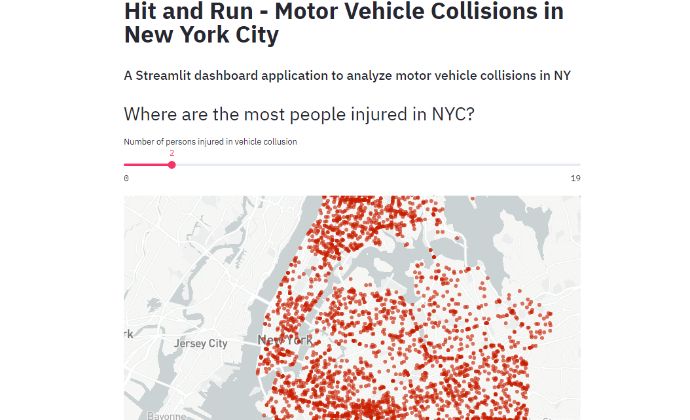

# Hit and Run
## A Data Science Web App with Streamlit and Python

A Streamlit dashboard application to analyze motor vehicle collisions in New York City.

## Place with most injured people

 

## Collisions in a given time

 

## Breakdown by minute

 

## Top 5 dangerous streets - Pedestrians Type

 

## Top 5 dangerous streets - Cyclists Type

 

## Top 5 dangerous streets - Motorists Type

 

## Raw Data

 
